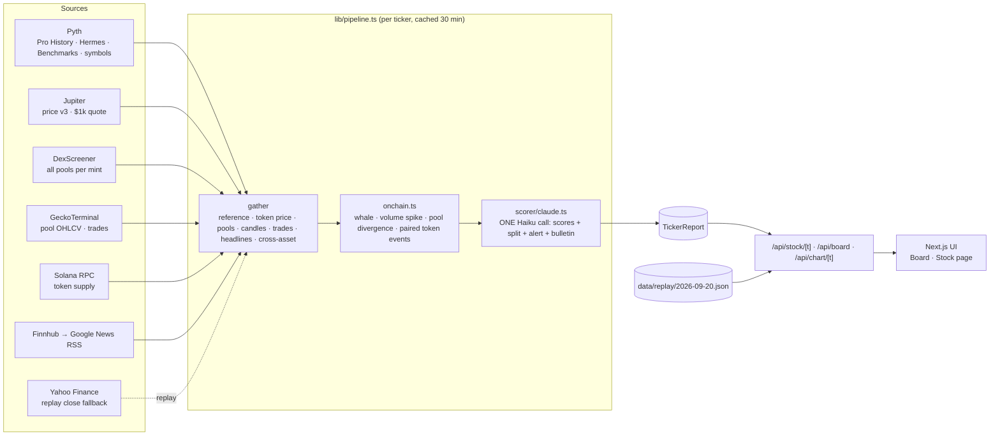

# Wick Wire

**Other tools tell you how much your tokenized stock moved while Wall Street was closed. Wick Wire tells you why.**

Live: https://wick-wire.vercel.app · Replay of a real weekend: https://wick-wire.vercel.app/?mode=replay

Built for the Solana Foundation **Stocklana** hackathon (Main track + Pyth bounty).

---

## The problem

US stocks trade about 6.5 hours a day, 5 days a week. Their tokenized versions on Solana (xStocks such as NVDAx, TSLAx) trade **24/7**, and a large share of that volume happens while the NYSE is closed.

So a holder in Lagos, Lisbon or Bengaluru wakes up on a Sunday to "NVDAx −3% since Friday's close". Existing tools show the gap. None of them say **why**:

- Was there real news (an export-curb report, an earnings pre-announcement, a lawsuit)?
- Or was it **on-chain**: one whale dumping into a thin pool, a volume spike in one DEX pool, a memecoin paired against the xStock dragging it, one pool drifting away from every other price?
- Or nothing at all, just thin weekend trading that will likely snap back at Monday's open?

That answer decides whether you sell, hedge, or wait for the bell.

## What Wick Wire does

For 8 xStocks (NVDA, TSLA, AAPL, MSFT, AMZN, META, SPY, QQQ):

1. **The wick:** token price now vs the **last real NYSE close**, with the market state (OPEN / AFTER-HOURS / OVERNIGHT / WEEKEND) and a countdown to the next open, driven by Pyth's own session schedule (holidays and early closes included).
2. **The wire (news):** every headline about the company since the bell.
3. **The wire (on-chain):** every DEX pool for the verified xStock mint, whale trades, hourly volume spikes, pools priced away from the reference, and **memecoins actually paired against the xStock** in a pool (we found real ones: `$SI/NVDAx`, `$STONK/SPYx`, `$VERITY/MSFTx`, …).
4. **Scoring:** one structured Claude Haiku call per ticker scores every event: probability it *caused this move*, category, importance, the news / on-chain / unexplained split, and whether holders should be alerted.
5. **The bulletin:** up to 3 plain-English sentences, written **only** from the scored events and real numbers. If nothing scores ≥ 0.4, it says so: *"No clear catalyst — likely thin weekend trading or sector/macro drift."*

6. **Gap signal (paper only):** FADE / RESPECT / NO TRADE per stock, with the real Jupiter $1,000 quote it would use. The replay panel checks the Sunday-night signal against the real Monday open, after fees, losses shown. Never executes. Not financial advice.

Every number shows its source. When a source fails, the UI says "unavailable" rather than guessing.

## Why Solana, and why Pyth

- The problem only exists because xStocks trade 24/7 **on Solana**, and half of the "why" lives on Solana itself (pools, whales, paired memecoins), readable only on-chain.
- **Pyth** gives the two worlds in one place: the regular equity feed (`Equity.US.TSLA/USD`) and the xStock feed (`Crypto.TSLAX/USD`), plus metals, FX and crypto for context. Wick Wire uses:
  - Pyth **Pro History** candles to read the last regular-session close (the 60-min candle ending 16:00 ET),
  - Pyth **Hermes** latest prices and **Benchmarks** historical prices for the cross-asset row (gold, BTC, EUR/USD over the same hours),
  - Pyth **symbols metadata** for market sessions and holidays (drives the OPEN/OVERNIGHT/WEEKEND state and countdown),
  - Pyth **entitlement check** (`/v1/symbols?entitled_only=true`): the app requests only feeds the key may read and falls back, labelled, for the rest. With a full Pro key every xStock and equity price switches to Pyth with no code change.

## Architecture



- `lib/stocks.ts`: tickers, Pyth feed ids (discovered via Hermes/Pyth symbols), **verified** xStock mints (Jupiter tokens API, `verified` + `xstocks` tag; look-alike pump tokens are rejected)
- `lib/market-hours.ts`: NYSE state from Pyth's schedule string
- `lib/pyth.ts`: entitlement-aware Hermes / Benchmarks / Pro History client
- `lib/onchain.ts`: pools, candles, trades → typed on-chain events
- `lib/news.ts`: Finnhub with Google News RSS fallback, company-relevance filter, dedupe
- `lib/scorer/`: `Scorer` interface + Claude Haiku implementation (structured output, zod-validated)
- `lib/pipeline.ts`: gather → events → score (cached by input hash) → report
- `scripts/build-replay.ts`: records a real past weekend into a JSON fixture

## Live vs Replay

- **Live** (default): current state of the market. First load of each ticker takes a while (free-tier rate limits on GeckoTerminal/Finnhub); results are cached for 30 minutes and scoring is cached by input hash, so the LLM is never called per page view.
- **Replay**: the real weekend of **Fri 18 Sep 2026 16:00 ET → Sun 20 Sep 2026 20:00 ET**, recorded once by `scripts/build-replay.ts` from Pyth, Yahoo Finance (Friday close for tickers our Pyth key isn't entitled to), GeckoTerminal, Google News and Claude. Clearly badged REPLAY. Zero API calls at demo time.

## Run it

```bash
cp .env.example .env.local   # fill PYTH_API_KEY, FINNHUB_KEY, ANTHROPIC_API_KEY
npm install
npm run dev                  # http://localhost:3000
npx tsx scripts/build-replay.ts   # (re)record the replay fixture
```

Spikes that proved each data source: `scripts/spikes/`.

## Costs (the whole thing runs on free/demo tiers)

- Claude Haiku 4.5: ~2.4k input / ~350 output tokens per ticker ≈ **$0.004 per ticker**, one call per ticker per 30 min at most, with a daily cap (`LLM_MAX_CALLS_PER_DAY`).
- Pyth: a handful of batched calls per refresh; entitlement-checked so nothing is wasted on 403s.
- Everything else: free, keyless endpoints.

## Limitations (honest list)

- **Pyth entitlements:** our demo key covers `Equity.US.TSLA/USD`, `Equity.US.QQQ/USD`, gold, BTC, EUR/USD. Other equity closes come from Finnhub (live) / Yahoo Finance (replay), and xStock prices from Jupiter / the main DEX pool, always labelled. A full Pyth Pro key makes all of them Pyth.
- **Scorer:** the Jev decision model was the plan; without a key we ship the same typed interface on Claude Haiku. Probabilities are model estimates, shown as such.
- **Whale trades** are live-only (GeckoTerminal keeps ~24 h of trades); replay shows hourly volume spikes instead and says so.
- **Supply change** since close needs a historical snapshot we don't have; we show current supply only.
- US market holidays come from Pyth's schedule; pre/post-market equity prices are not used for the "close".
- Read-only: no wallet, no transactions, no tokens, no contracts.

Not financial advice. Tokenized stocks are not available to US persons and are restricted in some regions.

## Credits

Design direction "The Night Desk" (Big Shoulders · Newsreader · IBM Plex Mono). Data: Pyth Network, Jupiter, DexScreener, GeckoTerminal, Solana RPC, Finnhub, Google News, Yahoo Finance. Scoring: Anthropic Claude Haiku 4.5.
